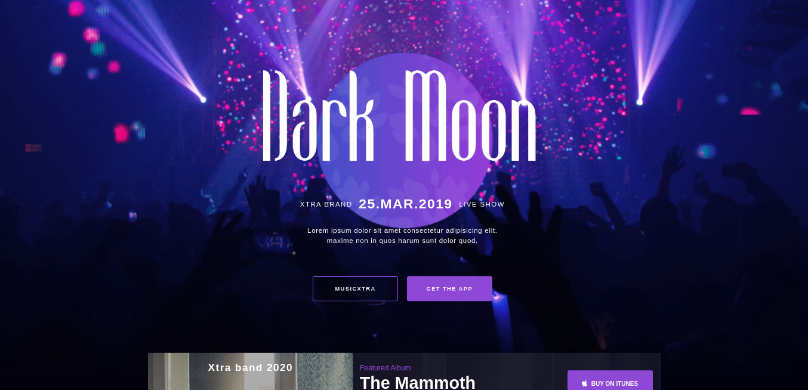

##MusicXtra Ui

Ohayo

This is a ui clone of [slidemusic theme dark theme](https://slide.smartwpress.com/demo4/) older version
If you like their current updates and make a clone please refer me. I'd love to see.

There is my first and favourite responsive frontend I built back in 2019 with html, css, javascript and sass. There's not much to it, just download and open with live server xo